# Assignment1-Preemption 报告

## Checkpoint 1

### 结果截图
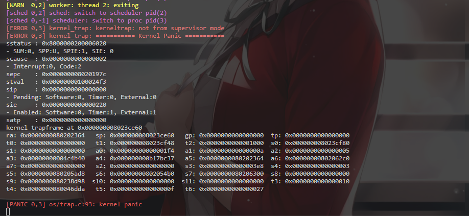

### 说明
- 本题完成了基础的抢占/调度验证流程。
- 从运行结果看，系统能够正常进入并处理时钟中断，调度路径可达，程序行为符合 checkpoint1 预期。

## Checkpoint 2

### 结果截图
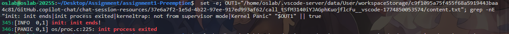

### 说明
- 问题根因是：在内核 Trap 中触发调度时，没有成对保护/恢复 `sstatus` 与 `sepc`，导致后续 `sret` 使用了被其他上下文影响后的 CSR 状态。
- 由于 `sret` 会依赖 `SPP` 位决定返回级别，若该位状态不正确，就可能出现异常返回（例如错误回到 U 模式），从而触发 `SPP:U` 类问题。
- 因此 checkpoint2 的关键是保证 Trap 内调度场景下的上下文一致性，避免 CSR 状态被“串台”。
- 为什么“总在第一个进程 exit 后更容易出现”：exit 会触发一次明确的 sched 切换；同时其它进程很多都停在 kernel_trap 的 yield 处,这会制造大量“Trap 内调度 -> 回来继续 sret”的场景；因此更容易踩到被污染/过期的 sstatus.SPP。

## Checkpoint 3

### 结果截图
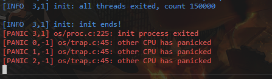
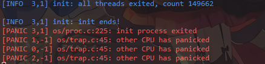

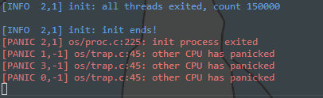
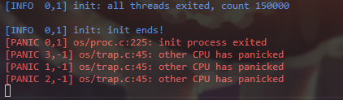
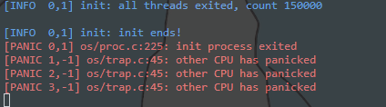
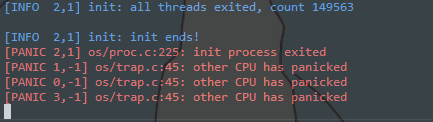
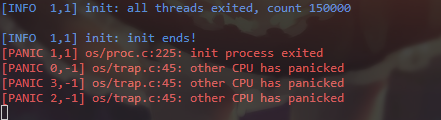
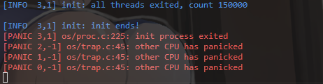
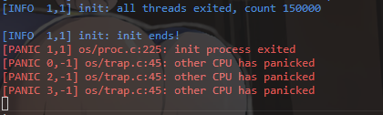

### 说明
- checkpoint3 主要体现了并发场景下计数结果的统计特征。
- `count` 大多数情况下是 `15000`，因为在理想执行中每次自增都被正确保留，最终总和稳定。
- 少数情况下不是 `15000`，是因为并发下存在竞争（读-改-写交错、抢占导致的丢失更新），因此会出现小概率偏差。

## 完成作业耗时

- 约 5 小时。

## 遇到的困难

- 主要困难在 checkpoint2，需要结合 lab 文档理解 trap 与调度切换细节后才能准确作答。

