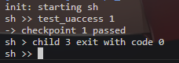
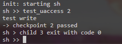
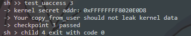
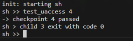

# Assignment 2 — UAccess Checkpoints

以下为本次作业各 Checkpoint 的实现、验证与结果摘要。

## Checkpoint 1
- 目标：修改页表模型，使用户页表包含整个内核页表；内核线程使用用户页表；在 context switch 与 trampoline 中保留/切换用户页表行为。
- 变更文件：`os/vm.c`（`mm_copy_kpgt`）、`os/switch.S`（保存/恢复 `satp`）、`os/trampoline.S`（不在 trap 时切换至独立内核页表）、`os/sched.c`（在 swtch 前设置 `context.satp`）。
- 验证：构建并运行内核，执行 `test_uaccess 1`，输出：



## Checkpoint 2
- 目标：将 `copy_to_user` / `copy_from_user` 改为直接 `memmove`，并处理因内核直接访问用户地址导致的 Page Fault（设置 `SSTATUS_SUM`）。
- 变更文件：`os/uaccess.c`（使用 `memmove`，并在访问前后设置/清除 `SSTATUS_SUM`），并实现 `access_ok` 检查。
- 验证：运行 `test_uaccess 2`（在 shell 中执行），能重现原来的 Page Fault，然后通过设置 SUM 解决，测试通过。



## Checkpoint 3
- 目标：`access_ok` 仅基于地址范围判断 `__user` 地址是否合法（不访问页表），确保 `TRAMPOLINE` / `TRAPFRAME` 等内核映射不被当成用户地址。
- 变更文件：`os/uaccess.c`（`access_ok` 实现，使用 `MAX_USERVA` / `TRAPFRAME` 边界判断）。
- 验证：运行 `test_uaccess 3`，通过。



## Checkpoint 4
- 目标：当在内核执行 `uaccess` 时遇到用户地址的 Page Fault，终止用户进程（`exit(-9)`）而非造成内核 panic；需要在处理过程中正确释放/调整锁与 CPU 状态以避免触发 `pop_off`/`sched` 的一致性检查。
- 变更文件：`os/trap.c`（在 kernel_trap 中识别用户地址页错，释放可能持有的 `p->mm->lock`、调整 `mycpu()->inkernel_trap` 与 `interrupt_on`，然后调用 `exit(-9)`）。
- 验证：在 `sh` 中执行 `test_uaccess 4`，输出（示例）：



（注：为便于展示，调试信息在合并前已被我注释掉；运行时仅保留必要的错误/结果信息。）

---

构建与运行命令示例：

```bash
make
make run    # 或 make runsmp
# 在 xv6 shell 中运行：
test_uaccess 1
test_uaccess 2
test_uaccess 3
test_uaccess 4
```

本次作业花费时长14小时。
