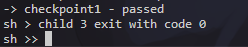
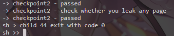
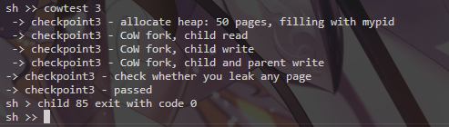
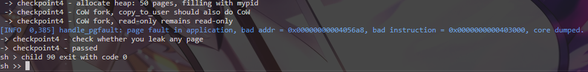

Assignment 3 - CoW Report

1. 完成时间

-  5 小时左右

2. 实现思路简述

- 参考计数：为每个用户物理页维护引用计数，映射时增加，释放时减少，仅在计数为 0 时真正 `kfreepage`。
- CoW 映射：`fork` 时不复制数据页，父子共享物理页，清除 `PTE_W` 并设置 CoW 标记；写入触发页错误后复制。
- Page fault：写时访问 CoW 页时分配新页、复制数据、更新 `PTE`（可写且清除 CoW），同时维护引用计数。
- `copy_to_user`：对目标页为 CoW 且不可写时进行同样的复制流程。

3. Checkpoint 结果与截图

3.1 Checkpoint 1

Checkpoint 1通过。该结果说明 fork 采用 CoW 后不会立即复制全部用户页，而是先共享物理页，因此在可用物理页不足时仍能成功创建子进程。

3.2 Checkpoint 2

Checkpoint 2通过。该结果说明共享页在进程退出或解除映射时会正确递减引用计数，并且只有引用计数归零才释放物理页，没有出现内存泄露。

3.3 Checkpoint 3

Checkpoint 3通过。该结果说明父子进程对共享页写入时能触发 CoW：分配新页、复制旧页内容并更新可写 PTE，最终父子进程持有独立物理页。

3.4 Checkpoint 4

Checkpoint 4通过。该结果说明内核向用户地址写入时，如果目标页是 CoW 共享页，也会执行与页错误路径一致的复制逻辑，避免直接写坏共享只读映射。

4. 困难与说明

- 需要谨慎处理引用计数，避免 `double free` 或 `use-after-free`。