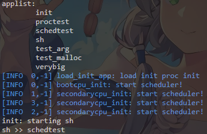
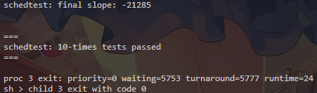

# Assignment 4 Scheduler Report

## Goal

在 xv6 上实现带优先级的调度策略，支持每个进程拥有不同长度的时间片，并在进程退出时输出调度统计信息。

## Implementation

本次实验完成了以下内容：

1. 为 `struct proc` 增加调度相关状态，用于记录进程优先级、剩余时间片、创建时间、运行时间等信息。
2. 在时钟中断处理路径中累计进程运行 tick，并在时间片耗尽时触发调度切换。
3. 实现 `setpriority` 系统调用，根据优先级动态设置进程的时间片长度。
4. 在进程退出时打印 `priority`、`waiting time`、`turnaround time` 和 `runtime`，便于验证调度效果。

时间片计算方式采用：`FULL_QUANTUM - priority * 2`，这是为了实现优先级数值越小，单次可运行时间越长。

## Checkpoint Result

启动多核 xv6 后运行 `schedtest`，可以稳定通过测试。优先级更高的进程通常更早结束，且最终输出的斜率为负，符合优先级调度的预期。

上图展示了系统启动后进入 `sh`，并且 `schedtest` 已出现在应用列表中，说明内核和用户程序都能正常加载。

本图展示了 `schedtest` 的最终结果：测试通过，输出了 10 轮测试成功信息，同时打印了进程退出时的调度统计，说明优先级调度与时间片统计都正常工作。

## Time Spent

完成本次作业总耗时：2小时

## Summary

个人认为本次实验中最关键的是确保时间片耗尽时才真正切换进程，并且在进程退出时正确统计等待时间与周转时间。
