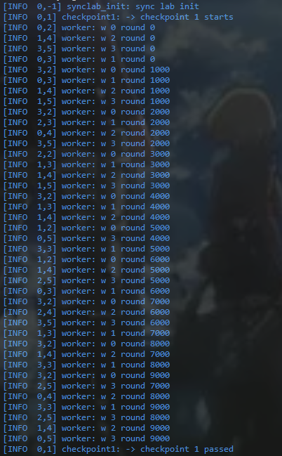

# Assignment 5 - Semaphore 报告

## 1. Checkpoint 运行截图

### Checkpoint 1

### Checkpoint 2

### Checkpoint 3

## 2. 完成作业耗时

- 总耗时：约 2 小时 30 分钟

## 3. 代码修改说明（修改了哪些文件、为什么修改）

### 3.1 [os/lock.h](os/lock.h)

- 修改内容：补全 `struct semaphore`，加入信号量计数值和内部自旋锁。
- 修改原因：Semaphore 需要保存可用资源数量（计数器），并且要在并发访问时保证原子性，所以需要内部锁保护。

### 3.2 [os/lock.c](os/lock.c)

- 修改内容：实现 `sem_init()`、`sem_wait()`、`sem_post()`。
- 修改原因：
	- `sem_init()`：初始化计数器和内部锁，建立信号量初始状态。
	- `sem_wait()`：当计数为 0 时睡眠阻塞；当计数大于 0 时减 1 并继续执行，满足 P 操作语义。
	- `sem_post()`：计数加 1 并唤醒等待线程，满足 V 操作语义。
	- 采用 sleep/wakeup 方式可避免忙等，符合内核同步机制设计。

### 3.3 [os/a5/checkpoint3.c](os/a5/checkpoint3.c)

- 修改内容：实现哲学家就餐同步逻辑，定义并初始化所需信号量。
- 修改原因：
	- 每根叉子使用一个二值信号量（初值 1），表示叉子互斥使用。
	- 新增一个 room 信号量（初值 NTHRS-1），限制同时尝试拿叉子的哲学家数量，破坏环路等待条件，从而避免死锁。
	- 全部同步只使用 Semaphore，满足作业限制。

## 4. 结果说明

- 在 `make runsmp` 下，3 个 checkpoint 全部通过，日志包含：
	- checkpoint 1 passed
	- checkpoint 2 passed
	- checkpoint 3 passed
	- all checks passed

## 5. （可选）实现思路简述

- 先实现内核态 Semaphore 的正确阻塞/唤醒语义，再将其应用到哲学家就餐问题。
- 就餐问题采用“叉子信号量 + 房间容量限制”方案，在保证并发性的同时避免死锁。