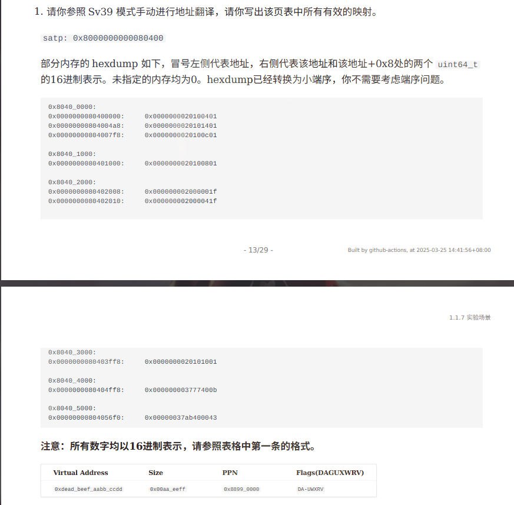

# CS302 Lab6 课堂报告

更新日期：2026-04-01

## 题目1：Sv39 地址拆分（VPN2/VPN1/VPN0/offset，二进制）

Sv39 虚拟地址拆分规则：

- VPN2 = VA[38:30]（9 bits）
- VPN1 = VA[29:21]（9 bits）
- VPN0 = VA[20:12]（9 bits）
- offset = VA[11:0]（12 bits）

计算结果如下：

| vaddr | VPN2 | VPN1 | VPN0 | offset |
|---|---|---|---|---|
| 0x0000_0000_8020_1234 | 000000010 | 000000001 | 000000001 | 001000110100 |
| 0x0000_003f_ffff_f000 | 011111111 | 111111111 | 111111111 | 000000000000 |
| 0xffff_ffd1_dead_beef | 101000111 | 011110101 | 011011011 | 111011101111 |

## 题目2：根据 satp + hexdump 手工页表翻译并列出有效映射

已知：

- satp = 0x8000000000080400
- Sv39 模式（MODE=8）
- satp 的低 44 位是根页表 PPN，所以：
	- 根页表 PPN = 0x80400
	- 根页表物理地址 = 0x80400 << 12 = 0x8040_0000

下面按“值从哪里来”的方式，逐步推导。

### 步骤1：由 hexdump 地址反推页表索引

规则：

- 在某一级页表内，`PTE地址 = 页表基址 + 索引 * 8`（Sv39 每个 PTE 8 字节）
- 所以 `索引 = (PTE地址 - 页表基址) / 8`

根页表基址是 0x8040_0000：

- 0x8040_0000 处有 PTE -> 索引 = (0x8040_0000 - 0x8040_0000)/8 = 0x0
- 0x8040_04a8 处有 PTE -> 索引 = 0x4a8/8 = 0x95
- 0x8040_07f8 处有 PTE -> 索引 = 0x7f8/8 = 0xff

因此根页表非零项是 `pte2[0x0]`、`pte2[0x95]`、`pte2[0xff]`。

### 步骤2：判断每个 PTE 是叶子还是下一级页表指针

规则：

- 若 X/W/R 三位全 0，则是“非叶子”（指向下一级页表）
- 否则是“叶子映射”

并且：

- `PPN = PTE >> 10`
- 下一级页表地址或物理页基址 = `PPN << 12`

对根页表 3 个 PTE 计算：

- `0x0000000020100401`：XWR 全 0，非叶子
	- PPN = 0x20100401 >> 10 = 0x80401
	- L1 页表地址 = 0x80401 << 12 = 0x8040_1000
- `0x0000000020101401`：XWR 全 0，非叶子
	- PPN = 0x80405
	- L1 页表地址 = 0x8040_5000
- `0x0000000020100c01`：XWR 全 0，非叶子
	- PPN = 0x80403
	- L1 页表地址 = 0x8040_3000

### 步骤3：继续遍历各 L1 页表

1. L1 页表 `0x8040_1000`

- 在 `0x8040_1000` 看到 `0x0000000020100801`
- 索引 `vpn1 = (0x80401000-0x80401000)/8 = 0`
- XWR 全 0，非叶子，指向 L0 页表：
	- PPN = 0x80402
	- L0 地址 = 0x8040_2000

2. L1 页表 `0x8040_3000`

- 在 `0x8040_3ff8` 看到 `0x0000000020101001`
- 索引 `vpn1 = (0x3ff8-0x3000)/8 = 0x1ff`
- XWR 全 0，非叶子，指向 L0 页表：
	- PPN = 0x80404
	- L0 地址 = 0x8040_4000

3. L1 页表 `0x8040_5000`

- 在 `0x8040_56f0` 看到 `0x00000037ab400043`
- 索引 `vpn1 = (0x56f0-0x5000)/8 = 0xde`
- 该项 `R=1`，所以是叶子映射（L1 叶子，2MiB huge page）
- PPN = 0x37ab400043 >> 10 = 0xdead000
- 该映射对应：
	- `vpn2 = 0x95`（来自根页表索引）
	- `vpn1 = 0xde`（本级索引）
	- `vpn0` 不参与索引（因为在 L1 结束）
	- 虚拟页基址 `VA = (vpn2<<30) | (vpn1<<21) = 0x255BC00000`
	- 大小 `Size = 2MiB = 0x20_0000`

### 步骤4：遍历 L0 页表，得到 4KiB 映射

1. L0 页表 `0x8040_2000`

- 在 `0x8040_2008`：PTE = `0x000000002000001f`
	- `vpn0 = (0x2008-0x2000)/8 = 1`
	- XWR 非 0，为叶子
	- PPN = 0x2000001f >> 10 = 0x80000
	- 已有 `vpn2=0, vpn1=0`（来自上层索引）
	- VA 基址 = `(0<<30)|(0<<21)|(1<<12) = 0x1000`
	- Size = 0x1000（4KiB）

- 在 `0x8040_2010`：PTE = `0x000000002000041f`
	- `vpn0 = 2`
	- 叶子
	- PPN = 0x80001
	- VA 基址 = `(0<<30)|(0<<21)|(2<<12) = 0x2000`
	- Size = 0x1000

2. L0 页表 `0x8040_4000`

- 在 `0x8040_4ff8`：PTE = `0x000000003777400b`
	- `vpn0 = (0x4ff8-0x4000)/8 = 0x1ff`
	- 叶子（X=1, R=1）
	- PPN = 0x3777400b >> 10 = 0xdddd0
	- 上层索引是 `vpn2=0xff, vpn1=0x1ff`
	- VA 基址 = `(0xff<<30)|(0x1ff<<21)|(0x1ff<<12) = 0x3FFFFFF000`
	- Size = 0x1000

### 步骤5：逐条写出 Flags(DAGUXWRV)

按位序 `D A G U X W R V`：

- `0x2000001f` 低位权限是 `...11111b`，即 `U X W R V = 1`，A/D/G=0 -> `---UXWRV`
- `0x2000041f` 同上 -> `---UXWRV`
- `0x37ab400043` 仅 A/R/V 置位 -> `-A----RV`
- `0x3777400b` 仅 X/R/V 置位 -> `----X-RV`

因此，有效映射共 4 条：

| Virtual Address | Size | PPN | Flags(DAGUXWRV) |
|---|---|---|---|
| 0x0000_0000_0000_1000 | 0x1000 | 0x0000_0000_0008_0000 | ---UXWRV |
| 0x0000_0000_0000_2000 | 0x1000 | 0x0000_0000_0008_0001 | ---UXWRV |
| 0x0000_0025_5bc0_0000 | 0x20_0000 | 0x0000_0000_0dea_d000 | -A----RV |
| 0x0000_003f_ffff_f000 | 0x1000 | 0x0000_0000_000d_ddd0 | ----X-RV |

说明：

- 上表中的 PPN 列写的是“物理页号（PPN）”，不是页基址。
- 4KiB 页（L0 叶子）大小恒为 0x1000；L1 叶子是 2MiB 页，大小 0x20_0000。
- 若老师要求填写“物理基址”而不是 PPN，可将 PPN 左移 12 位。

## 题目3：为什么 Sv32 的 VPN 是 10 位，而 Sv39 的 VPN 是 9 位

核心原因是“页表大小固定为一页（4KiB）”，而每个 PTE 大小不同。

- 每个页表页容量：4KiB = 4096B。
- Sv32：每个 PTE 为 4B，所以一个页表可容纳 4096 / 4 = 1024 = 2^10 个表项，因此每级 VPN 索引需要 10 位。
- Sv39：每个 PTE 为 8B，所以一个页表可容纳 4096 / 8 = 512 = 2^9 个表项，因此每级 VPN 索引需要 9 位。

结论：VPN 位数由“每页可容纳的 PTE 个数”决定；PTE 越大，每页项数越少，索引位数越小。
